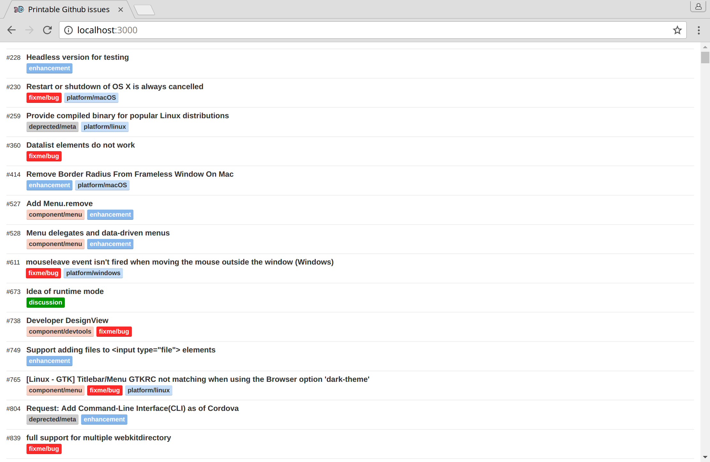

Printable-Github-issues
=======================

Get a print ready, minimalistic view of all your (private) Github repo's issues.

Install
-------

1. Duplicate `env.example` to `env.sh` (it is protected by .gitignore)
1. Configure the variables in `env.sh`
1. Run `npm install`

Run
---
1. Run `source env.sh` into your terminal to export all the variables
1. Run `npm run start`
1. Visit http://localhost:3000 in a browser
